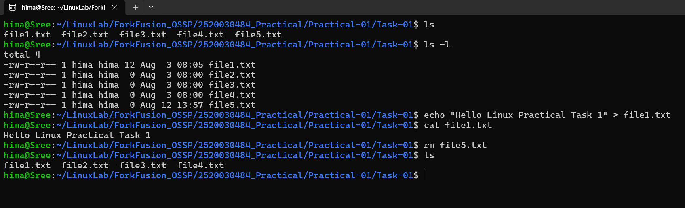

# Practical-01: Create and Manage Files

## Objective

To practice basic Linux file management commands by creating, listing, viewing, modifying, and deleting files.

---

## Problem Statement

Perform the following operations using Linux commands:

1. Create a directory named `Task-01`.
2. Enter the directory.
3. Create five empty files (`file1.txt` to `file5.txt`).
4. List all files.
5. Display detailed information about the files.
6. Add content to `file1.txt`.
7. Display the contents of `file1.txt`.
8. Delete `file5.txt`.
9. List the remaining files.

---

## Commands Used

```bash
mkdir Task-01
cd Task-01
touch file1.txt file2.txt file3.txt file4.txt file5.txt
ls
ls -l
echo "Hello Linux Practical Task 1" > file1.txt
cat file1.txt
rm file5.txt
ls
```

---

## Files Included

- file1.txt
- file2.txt
- file3.txt
- file4.txt

---

## Output



---

## Concepts Learned

- Creating directories using `mkdir`
- Creating files using `touch`
- Listing files using `ls`
- Viewing detailed file information using `ls -l`
- Writing content to a file using `echo`
- Reading file contents using `cat`
- Deleting files using `rm`
- Understanding basic Linux file management
