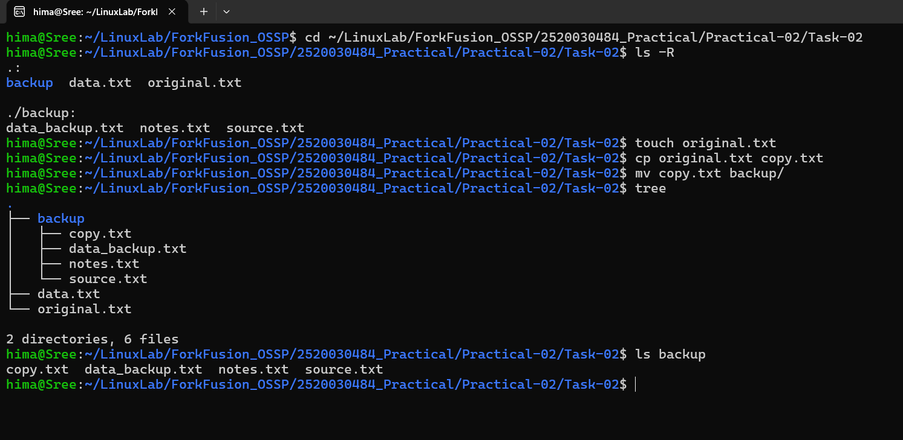

# Practical-02: Copy and Move Files

## Objective

To practice Linux file management by copying and moving files between directories.

---

## Problem Statement

Perform the following operations using Linux commands:

1. Create a file named `original.txt`.
2. Copy `original.txt` to `copy.txt`.
3. Create a directory named `backup`.
4. Move `copy.txt` into the `backup` directory.
5. Display the directory structure.
6. Display the contents of the `backup` directory.

---

## Commands Used

```bash
touch original.txt
cp original.txt copy.txt
mv copy.txt backup/
tree
ls backup
```

---

## Files Included

- original.txt
- data.txt
- backup/
  - copy.txt
  - data_backup.txt
  - notes.txt
  - source.txt

---

## Output



---

## Concepts Learned

- Creating files using `touch`
- Copying files using `cp`
- Moving files using `mv`
- Viewing directory structure using `tree`
- Listing directory contents using `ls`
- Understanding directory organization in Linux
