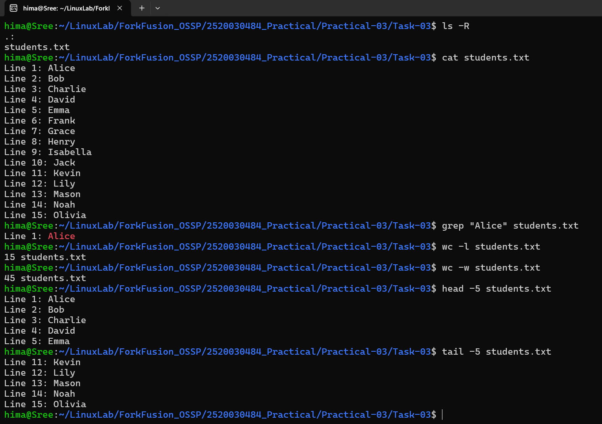

# Practical-03: Search and View File Contents

## Objective

To practice searching, viewing, and analyzing text files using basic Linux commands.

---

## Problem Statement

Perform the following operations using Linux commands:

1. Display the contents of a text file.
2. Search for a specific word or name in the file.
3. Count the number of lines in the file.
4. Count the number of words in the file.
5. Display the first few lines of the file.
6. Display the last few lines of the file.

---

## Commands Used

```bash
cat students.txt
grep "Alice" students.txt
wc -l students.txt
wc -w students.txt
head -5 students.txt
tail -5 students.txt
```

---

## Files Included

- students.txt

---

## Output



---

## Concepts Learned

- Viewing file contents using `cat`
- Searching text using `grep`
- Counting lines and words using `wc`
- Displaying the beginning of a file using `head`
- Displaying the end of a file using `tail`
- Basic text processing in Linux
