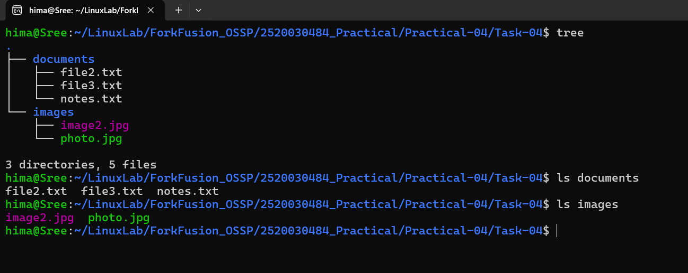

# Practical-04: Organize Files

## Objective

To organize files into different directories using Linux file management commands.

---

## Problem Statement

Organize files into appropriate directories using the `mv` command.

### Steps Performed

1. Created a `documents` directory.
2. Created an `images` directory.
3. Moved all `.txt` files into the `documents` directory.
4. Moved all `.jpg` files into the `images` directory.
5. Renamed `file1.txt` to `notes.txt`.
6. Renamed `image1.jpg` to `photo.jpg`.
7. Verified the final directory structure.

---

## Commands Used

```bash
mkdir documents
mkdir images

mv *.txt documents/
mv *.jpg images/

mv documents/file1.txt documents/notes.txt
mv images/image1.jpg images/photo.jpg

tree
```

---

## Final Directory Structure

```
Task-04
├── documents
│   ├── file2.txt
│   ├── file3.txt
│   └── notes.txt
└── images
    ├── image2.jpg
    └── photo.jpg
```

---

## Output



---

## Concepts Learned

- Creating directories using `mkdir`
- Moving files using `mv`
- Renaming files using `mv`
- Organizing files based on file type
- Viewing directory structure using `tree`

---

## Conclusion

Successfully organized text and image files into separate directories, renamed the required files, and verified the final directory structure using Linux commands.
