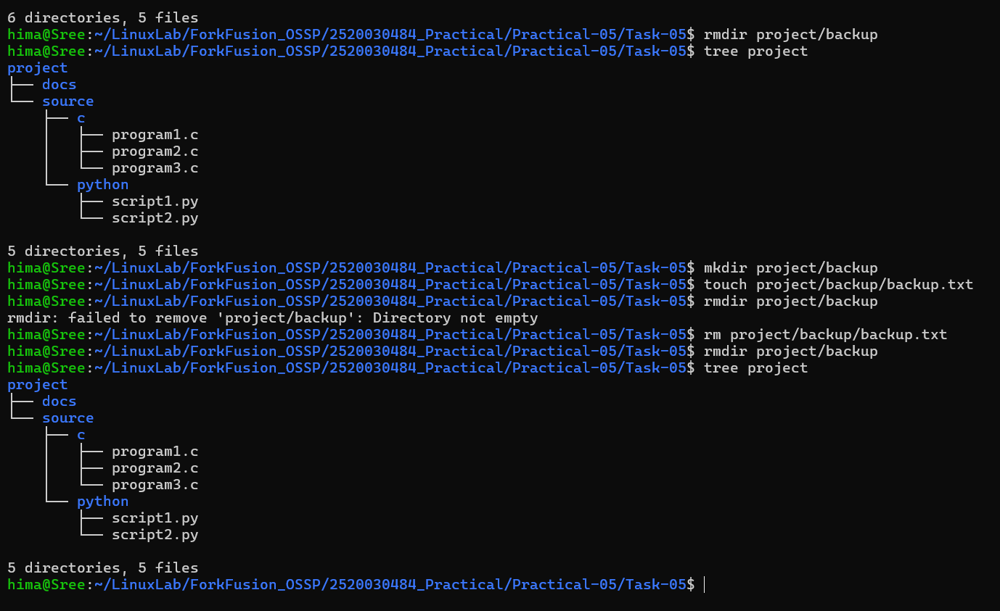

# Practical-05: Directory Management

## Task 5: Directory Management

### Objective

Practice creating nested directories and removing them using Linux commands.

---

## Directory Structure

The required directory structure is:

```text
project/
├── source/
│   ├── c/
│   └── python/
├── docs/
└── backup/
```

---

## Tasks Performed

1. Created the `project` directory.
2. Created the `source`, `c`, `python`, `docs`, and `backup` directories.
3. Created three files inside `source/c`.
4. Created two files inside `source/python`.
5. Listed the complete directory structure.
6. Removed the empty `backup` directory using `rmdir`.
7. Created the `backup` directory again.
8. Created a file inside the `backup` directory.
9. Tried to remove the non-empty `backup` directory using `rmdir`.
10. Observed that `rmdir` failed because the directory was not empty.
11. Deleted the file inside `backup`.
12. Successfully removed the empty `backup` directory using `rmdir`.

---

## Commands Used

### Create the backup directory

```bash
mkdir project/backup
```

### Create a file inside backup

```bash
touch project/backup/backup.txt
```

### Try to remove the non-empty directory

```bash
rmdir project/backup
```

Expected result:

```text
rmdir: failed to remove 'project/backup': Directory not empty
```

### Delete the file inside backup

```bash
rm project/backup/backup.txt
```

### Remove the now-empty backup directory

```bash
rmdir project/backup
```

### Display the directory structure

```bash
tree project
```

---

## Final Directory Structure

After completing all the operations, the final structure is:

```text
project/
├── docs/
└── source/
    ├── c/
    │   ├── program1.c
    │   ├── program2.c
    │   └── program3.c
    └── python/
        ├── script1.py
        └── script2.py
```

The `backup` directory is not present in the final structure because it was successfully removed after its contents were deleted.

---

## Output



---

## Concepts Learned

- Creating directories using `mkdir`
- Creating files using `touch`
- Creating nested directory structures
- Listing directory structures using `tree`
- Removing empty directories using `rmdir`
- Understanding why `rmdir` cannot remove non-empty directories
- Removing files using `rm`

---

## Conclusion

The directory management task was successfully completed. The experiment demonstrated that `rmdir` can remove only empty directories. When the `backup` directory contained a file, the removal operation failed. After deleting the file, the empty `backup` directory was successfully removed using `rmdir`.
