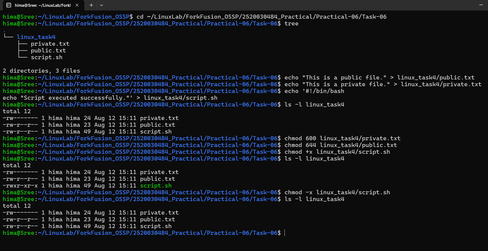

# Practical-06: File Permissions Using chmod

## Task 6: File Permissions Using chmod

### Objective

Understand Linux file permissions and practice modifying them using the `chmod` command.

---

## Tasks Performed

1. Created a directory called `linux_task4`.
2. Created three files:
   - `public.txt`
   - `private.txt`
   - `script.sh`
3. Added content to each file.
4. Displayed the current permissions using `ls -l`.
5. Set `private.txt` permission to `600`.
6. Set `public.txt` permission to `644`.
7. Added execute permission to `script.sh`.
8. Checked the permissions again.
9. Removed execute permission from `script.sh`.

---

## Commands Used

```bash
mkdir linux_task4

echo "This is a public file." > linux_task4/public.txt
echo "This is a private file." > linux_task4/private.txt

echo '#!/bin/bash
echo "Script executed successfully."' > linux_task4/script.sh

ls -l linux_task4

chmod 600 linux_task4/private.txt
chmod 644 linux_task4/public.txt
chmod +x linux_task4/script.sh

ls -l linux_task4

chmod -x linux_task4/script.sh

ls -l linux_task4
```

---

## Permission Changes

| File | Permission | Meaning |
|---|---|---|
| `private.txt` | `600` | Owner can read and write; group and others have no permissions |
| `public.txt` | `644` | Owner can read/write; group and others can read |
| `script.sh` | `+x` | Execute permission was added |
| `script.sh` | `-x` | Execute permission was removed |

---

## Final Directory Structure

```text
linux_task4/
├── private.txt
├── public.txt
└── script.sh
```

---

## Output



---

## Concepts Learned

- Understanding Linux file permissions
- Using `ls -l` to view permissions
- Using `chmod` to change permissions
- Numeric permissions such as `600` and `644`
- Adding execute permission using `chmod +x`
- Removing execute permission using `chmod -x`

---

## Conclusion

The file permissions task was successfully completed. The permissions of `private.txt` and `public.txt` were changed according to the requirements. Execute permission was added to `script.sh` and then removed successfully using `chmod`.
