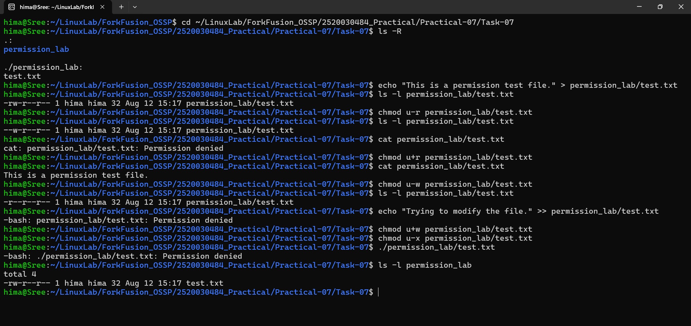

# Practical-07: File Permission Challenge

## Task 7: File Permission Challenge

### Objective

Understand how permissions affect files and directories in Linux.

---

## Tasks Performed

1. Created a directory called `permission_lab`.
2. Created a file called `test.txt`.
3. Added content to the file.
4. Removed read permission from the file.
5. Tried to read the file using `cat`.
6. Restored read permission.
7. Removed write permission.
8. Tried to modify the file.
9. Restored write permission.
10. Removed execute permission.
11. Tried to execute the file using `./test.txt`.

---

## Commands Used

```bash
mkdir permission_lab

echo "This is a permission test file." > permission_lab/test.txt

ls -l permission_lab/test.txt

chmod u-r permission_lab/test.txt

cat permission_lab/test.txt

chmod u+r permission_lab/test.txt

cat permission_lab/test.txt

chmod u-w permission_lab/test.txt

echo "Trying to modify the file." >> permission_lab/test.txt

chmod u+w permission_lab/test.txt

chmod u-x permission_lab/test.txt

./permission_lab/test.txt

ls -l permission_lab
```

---

## Permission Experiments

### 1. Removing Read Permission

```bash
chmod u-r permission_lab/test.txt
```

Attempting to read the file using `cat` resulted in:

```text
Permission denied
```

### 2. Restoring Read Permission

```bash
chmod u+r permission_lab/test.txt
```

The file could then be read successfully.

### 3. Removing Write Permission

```bash
chmod u-w permission_lab/test.txt
```

Attempting to modify the file resulted in:

```text
Permission denied
```

### 4. Restoring Write Permission

```bash
chmod u+w permission_lab/test.txt
```

### 5. Removing Execute Permission

```bash
chmod u-x permission_lab/test.txt
```

Attempting to execute the text file using:

```bash
./permission_lab/test.txt
```

resulted in:

```text
Permission denied
```

---

## Final Directory Structure

```text
permission_lab/
└── test.txt
```

---

## Final Permissions

```text
-rw-r--r--  test.txt
```

The final permission setting allows the owner to read and write the file, while group and other users have read permission.

---

## Output



---

## Concepts Learned

- Linux file permissions
- Read (`r`) permission
- Write (`w`) permission
- Execute (`x`) permission
- Using `chmod` to modify permissions
- Understanding `Permission denied` errors
- Checking permissions using `ls -l`

---

## Conclusion

The file permission challenge was successfully completed. The effects of removing and restoring read, write, and execute permissions were demonstrated using Linux commands. The expected `Permission denied` errors were observed when attempting operations without the required permissions.
