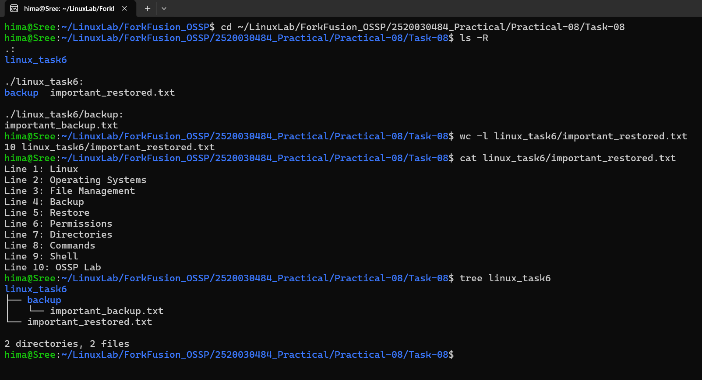

# Practical-08: Backup and Restore

## Task 8: Backup and Restore

### Objective

Create backups and restore files using the `cp` command.

---

## Tasks Performed

1. Created a directory called `linux_task6`.
2. Created a file called `important.txt`.
3. Added 10 lines of content to the file.
4. Created a directory called `backup`.
5. Copied `important.txt` into `backup`.
6. Renamed the backup as `important_backup.txt`.
7. Deleted the original `important.txt`.
8. Copied the backup back to the main directory.
9. Renamed the restored file as `important_restored.txt`.
10. Displayed the contents of the restored file.

---

## Commands Used

```bash
mkdir linux_task6

touch linux_task6/important.txt

mkdir linux_task6/backup

cp linux_task6/important.txt linux_task6/backup/

mv linux_task6/backup/important.txt linux_task6/backup/important_backup.txt

rm linux_task6/important.txt

cp linux_task6/backup/important_backup.txt linux_task6/

mv linux_task6/important_backup.txt linux_task6/important_restored.txt

wc -l linux_task6/important_restored.txt

cat linux_task6/important_restored.txt

tree linux_task6
```

---

## Restored File Content

The restored file contains 10 lines:

```text
Line 1: Linux
Line 2: Operating Systems
Line 3: File Management
Line 4: Backup
Line 5: Restore
Line 6: Permissions
Line 7: Directories
Line 8: Commands
Line 9: Shell
Line 10: OSSP Lab
```

---

## Final Directory Structure

```text
linux_task6/
├── backup/
│   └── important_backup.txt
└── important_restored.txt
```

---

## Verification

The command:

```bash
wc -l linux_task6/important_restored.txt
```

confirmed that the restored file contains:

```text
10 linux_task6/important_restored.txt
```

The `cat` command successfully displayed all 10 lines, confirming that the file was restored correctly.

---

## Output



---

## Concepts Learned

- Creating directories using `mkdir`
- Creating files using `touch`
- Copying files using `cp`
- Renaming files using `mv`
- Deleting files using `rm`
- Creating backups
- Restoring files from backups
- Verifying file contents using `cat`
- Counting lines using `wc -l`
- Viewing directory structures using `tree`

---

## Conclusion

The backup and restore task was successfully completed. The original `important.txt` file was backed up, renamed, and deleted. The backup was then copied back to the main directory and restored as `important_restored.txt`. The restored file was verified to contain all 10 lines of the original content.
