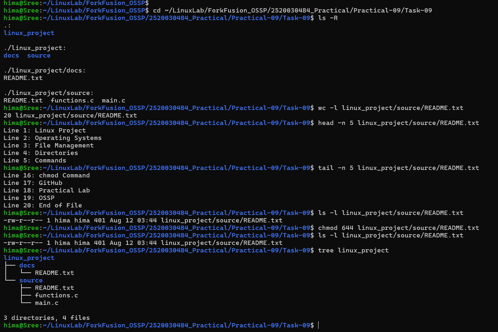

# Practical-09: Complete Linux File Management Challenge

## Objective
Use Linux file-management commands together.

## Tasks Performed
- Created `linux_project` with `source`, `backup`, and `docs`.
- Created `main.c`, `helper.c`, and `README.txt`.
- Added 20 lines to `README.txt`.
- Displayed first and last 5 lines using `head` and `tail`.
- Copied files using `cp`.
- Renamed `helper.c` to `functions.c`.
- Set `README.txt` permissions to `644`.
- Deleted the copied file and removed the empty `backup` directory.
- Verified the final structure using `tree`.

## Final Structure

```text
linux_project/
├── docs/
│   └── README.txt
└── source/
    ├── README.txt
    ├── functions.c
    └── main.c
```

## Verification

```text
20 linux_project/source/README.txt
-rw-r--r--
```

## Output



## Conclusion

Task-09 was successfully completed and the final directory structure and file permissions were verified.
