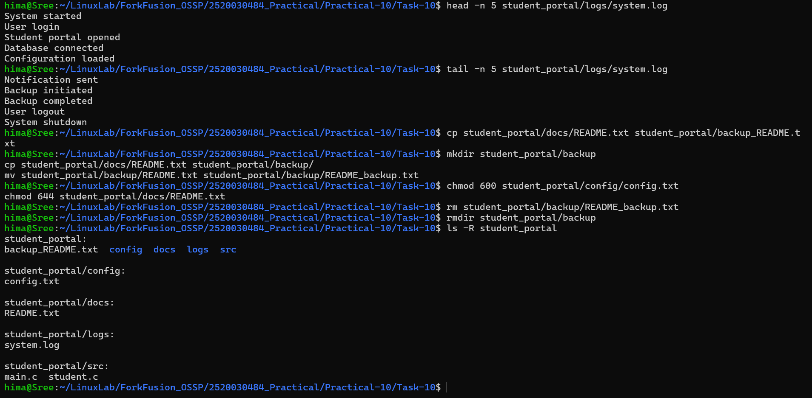

# Practical-10: Mini Linux Administration Challenge

## Task 10: Mini Linux Administration Challenge

### Objective
Complete a real-world-style Linux file management exercise using Linux commands.

---

## Requirements Completed

- Created the `student_portal` directory structure.
- Created `main.c`, `student.c`, `README.txt`, `config.txt`, and `system.log`.
- Added 15 lines to `system.log`.
- Displayed the first and last 5 lines of the log.
- Copied and renamed `README.txt` as a backup.
- Set `config.txt` permission to `600`.
- Set `README.txt` permission to `644`.
- Deleted the backup file.
- Removed the empty `backup` directory.
- Displayed the final structure using `ls -R`.

---

## Commands Used

```bash
mkdir student_portal
mkdir student_portal/src student_portal/docs student_portal/backup
mkdir student_portal/logs student_portal/config

touch student_portal/src/main.c
touch student_portal/src/student.c
touch student_portal/docs/README.txt
touch student_portal/config/config.txt
touch student_portal/logs/system.log

head -n 5 student_portal/logs/system.log
tail -n 5 student_portal/logs/system.log

mkdir student_portal/backup
cp student_portal/docs/README.txt student_portal/backup/
mv student_portal/backup/README.txt student_portal/backup/README_backup.txt

chmod 600 student_portal/config/config.txt
chmod 644 student_portal/docs/README.txt

rm student_portal/backup/README_backup.txt
rmdir student_portal/backup

ls -R student_portal
```

---

## Final Directory Structure

```text
student_portal/
├── config/
│   └── config.txt
├── docs/
│   └── README.txt
├── logs/
│   └── system.log
└── src/
    ├── main.c
    └── student.c
```

---

## Verification

```text
system.log → 15 lines
config.txt → 600 (-rw-------)
README.txt → 644 (-rw-r--r--)
```

The first 5 and last 5 lines of `system.log` were successfully displayed.

---

## Output



---

## Conclusion

Task-10 was successfully completed. The required files and directories were created, file permissions were configured, backup operations were performed, and the final structure was verified using Linux commands.
